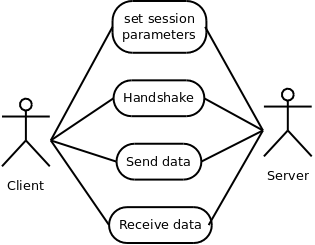
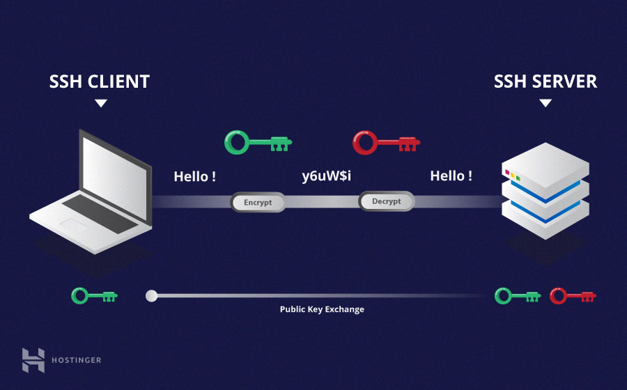
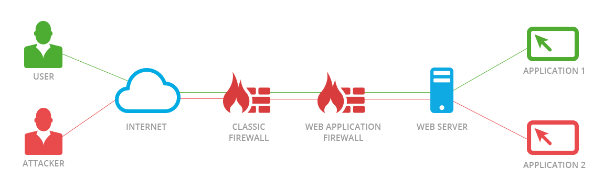
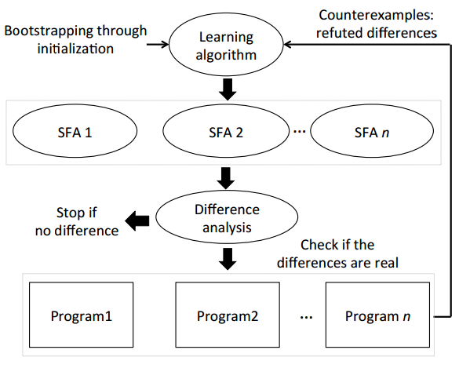

## Welcome to the Automata Learning Blog by Johnathan DiMatteo

Imagine yourself as a child examining a coffee machine for the first time.
Your curiousity is grand, you would like to know what it is and how it works.
No need for a manual, you push some buttons and wait as the machine responds.
Quickly you realise the big button on top turns the machine on and the button to the right pours coffee - but wait!
The button on the right does not pour coffee when the machine is off.
It exhibits some *state dependent* behaviour.
Over time, you start to construct a model of the device in your brain: which buttons trigger which responses and under what conditions.
This is what automata learning achieves; more specifically, about the design of algorithms that perform this task automatically.

State diagram of someone's life.

> Definition of automata learning: Given a black box system, construct an automata representation by providing inputs and observing outputs.

The first and oldest automata learning algorithm we will look at is L*, developed by Dana Angluin in *Learning Regular Sets from Queries and Counter-Examples* (1987).
Nearly all automata learning algorithms today use a similar approach.
Through *membership* and *equivalence* queries, the algorithm is able to construct a state diagram of the system.
An omniscient *oracle* is necessary for this type of learning, but it can be approximated in practice (at the cost of complexity!). 

1. **Membership Query**: The algorithm sends an input sequence and receives an output from the system.
2. **Equivalence Query**: The algorithm asks an Oracle if the automata learned so far is correct. If not, it sends back a counter-example.

Looking back at our coffee machine example, a membership query could be the following: press a bunch of buttons, and the coffee machine does something. 
Similarity, an equivalence query could be the following: explain to your older brother how you think the machine works. He responds with a counter example if you are wrong, and pats you on the back if you are correct (we are done!).

So the next logical question you may be wondering - how exactly does L* turn a bunch of membership queries into a state diagram?
It works by incrementally constructing an *Observation Table* through membership queries.
An element in the table is the Oracle's response to an input sequence.
Once a table is *closed* and *consistent*, the algorithm asks an equivalence query (for more details on these properties, see the original paper by Dana Angluin).

An observation table.

And finally, returning to our notion of an omniscient oracle: how necessary is this requirement in practice?
In terms of membership queries, a system just has to be able to respond.
The oracle can just pass the response to the algorithm.
But equivalence queries are problematic.
Thankfully, we approximate an Oracle by using brute force: given a hypothesized automata model from the algorithm, test it's correctness by sending thousands of inputs and making sure the response from the system is what we expect according to our model.
If there is a discrepancy, return the counter-example back to the algorithm.

### Are There Any Newer Algorithms?
But since 1987, the L STAR algorithm of Dana Angluin has been considerably improved.
One issue with the original L STAR algorithm is that using all inputs from a counterexample, which may be long and sparse, may lead to redundant membership queries. 
Rivest and Schapire's revised algorithm only selects the most important inputs from a counterexample .
A further improvement in 1994 by Kearns and Vazirani replaces the entire data structure used by L STAR with a decision tree, which is much more efficient.
Lastly, the most efficient algorithm for active learning to date, the TTT algorithm by Isberner et al., builds upon the previous improvements by optimizing the structure of the tree.
Implementations of all algorithms can be found in <a href="https://learnlib.de/">Learnlib</a>, which is where most applications examined in this survey get their code from.

### Examples of Applications Using L STAR (or a modification of L STAR)

***Transport Layer Security***

GnuTLS.

The first example of using automata learning on a protocol is Transport Layer Security (TLS), a communication protocol between client/server applications over the internet.
Rutier and Poll found an implementation of TLS (GnuTLS v3.3.8) with a bug that made it possible to bypass the authentication.
This exemplifies the importance of formal verification, especially for network protocols, as the specifications leave developers with significant freedom as how to implement the protocol.
In total, three out of nine TLS implementations tested had flaws in them.
Since no prior knowledge of the system is necessary, and a clear visual representation of the model is outputted, we consider this strategy to be very useful.

***Secure Shell***

Cryptographic SSH.

Vaandrager et al. use automata learning on the Secure Shell (SSH).
SSH is a communication protocols used by computer networks, part of the Internet protocol suite.
SSH is at the application level and is very complex.
Work was limited on the implementation of the server, and not of the client. 
Algorithms for encryption, compression and hashing are left to default settings.
The transport, authentication, and connection layers each have their own model.
Modules were created in order to map the large input space of SSH into a finite number of inputs, called Mappers.
This involved significant effort and the resulting mapper still needed to be tuned so that the learning algorithm had a smaller execution time.

***Internet of Things***

IoT devices are everywhere.

Internet of Things (IoT) devices are everywhere, posing a severe security risk if vulnerabilities are found.
Devices use Message Querying Telemetry Transport (MQTT), a message protocol built on top of standard TCP.
In total, 18 faults were found in four of out five MQTT systems modelled with Mealy Machines by Tappler et al., which are currently being reviewed.
The Mealy Machine models of MQTT were created with a modified version of the L STAR algorithm and then manually cross checked for equivalence with the MQTT specifications.
With minimal knowledge of the MQTT specifications, the authors were able to implement mappers (just like in SSH to create an abstraction of the input space.
Creating a mapper requires significantly less effort than creating an entire model from scratch from the natural language requirements and specifications.

***Bankcards***

Bankcards hold security sensitive information and assets.

Bankcards, cards issued by financial institutions to draw money, purchase items, etc., are used everyday by millions of people and hold security sensitive information and assets.
Aarts et al. find differences in security-critical bankcard protocols offered by several popular banking institutions.
A common theme in all applications examined so far is that the security vulnerabilities arise from different implementations of some standard.
Similarly in this case, there is a ISO/IEC 7816 standard to ensure both security and privacy, but each financial institution has their own implementation.
The differences may or may not lead to security vulnerabilities, but illuminates the problems that may arise with under-specified standards, just as we've seen with networking protocols.

***Internet Relay Chat***

An IRC is used to chat to your friends.

Internet Relay Chat (IRC) is an open source software that runs a chat server on Linux systems.
Hsu and Lee apply automata learning to an IRC, motivated by a severe backdoor found in *UnrealIRCd* in 2009 (https://lwn.net/Articles/392201/).
The backdoor was not found for months and it allowed an attacker to run any command on a system running the server with the privileges of that user.
A model that can describe the behaviour of the protocol implementation was constructed, including any hidden malicious code, to prevent cases like this from happening in the future.
Before they could begin, they had to address a limitation of the automata algorithms not examined so far -- they can only deal with completely specified systems.
A system is said to be completely specified if for every input there is a corresponding output (i.e. no inputs are ignored).
This often not the case.
For example, at the initial state of an IRC server, only login functions are expected, all other inputs are not processed, so the system is not completely specified.
To fix this, an adapted L STAR algorithm for Incompletely Specified Finite State Machines (ISFSM) is developed.

***Web Application Firewalls***

An IRC is used to chat to your friends.

Web Application Firewalls (WAF) filter traffic to and from a web application to prevent malicious inputs.
To prevent fingerprinting, we would like to keep the version of the WAF running on a server unknown to the user.
Argyros et al. use a differential automata learning framework called SFADiff to check for the differences between various versions of WAFs (and also TCP). 
SFADiff proves that it is possible for an attacker to learn the specific version of WAF running on the server in a completely black box manner.
Instead of a normal equivalence query, the SFA models are compared to each other before checking the actual systems.
This type of learning is best described with an analogy.
Consider the case of two students trying to solve a riddle posed by a teacher.
A normal equivalence query would be like a student asking the teacher if their individual solution was correct or not.
Instead, differential testing has the students compare each other's answers first.
If they are the same, the students are more confident in their answer, and so they approach the teacher with the solution.
If they are not the same, they can revise their solutions using the information they have gained.
Using this technique, SFADiff reduces the number of equivalence queries by 50x on average.
The amount of membership queries goes up by 1.15x on average.

SFADiff architecture.

### Challenges
***Non Determinism***
A significant challenge faced in almost all applications of automata learning to date is dealing with non-determinism.
Current tools such as LearnLib, the most popular automata learning library, do not support probabilistic behaviour.
Often, researchers are forced to deal with non-determinism in one of three ways: 
(1) combine several different outcomes into one, 
(2) repeat observations an odd number of times and vote,
and (3) remove any time dependent properties of the target system.
For example, packet sniffers are often used to capture the response of TCP implementations, but they can sometimes miss. 
To deal with this, observations must be repeated three times with a vote to ensure consistency.
The consequence of this of course is increased execution time, which is a significant problem for researchers.

***Time Complexity***
Execution time in general is a problem for automata learning.
The most common ways of addressing time complexity is to increase the efficiency of the Random Walk/W-method or to decrease the size of the input alphabet.

***Mappers***
As discussed in some of the applications, the automata learning process is not completely black box.
Manual effort is still required to build mappers to abstract large input space to an alphabet of around 10-20 inputs depending on the application.
Future research should be directed at incorporating the mapper into the learning process itself.
One way to do this could be through clustering, a machine learning technique where samples are grouped together based on similarity, but we have yet to see this in current research.

***Algorithms***
Most applications still use the original L STAR algorithm from 1987, or some slight modification of it.
It is surprising that the adoption of the TTT and Discrimination Tree algorithms has been so slow.
This can be either attributed to the relative simplicity of the L STAR algorithm, or researchers not knowing the existence of the TTT algorithm.
In either case, the TTT (and Discrimination Tree) algorithms are underutilized.

### L * Code
<a href="https://github.com/gbossert/pylstar">Python - gbossert Github</a>  
<a href="https://learnlib.de/">Java - Learnlib</a>

### References
[1]  F.  Aarts,  J.  De  Ruiter,  and  E.  Poll.   Formal  models  of  bank  cards  for  free.   In2013  IEEE  SixthInternational  Conference  on  Software  Testing,  Verification  and  Validation  Workshops, pages 461–468,March 2013.  
[2]  Dana Angluin. Learning regular sets from queries and counterexamples.Information and computation,75(2):87–106, 1987.  
[3]  George Argyros, Ioannis Stais, Suman Jana, Angelos D Keromytis, and Aggelos Kiayias. Sfadiff:  Auto-mated evasion attacks and fingerprinting using black-box differential automata learning. InProceedingsof  the  2016  ACM  SIGSAC  Conference  on  Computer  and  Communications  Security, pages 1690–1701.ACM, 2016.  
[4]  T. S. Chow.  Testing software design modeled by finite-state machines.IEEE Transactions on SoftwareEngineering, SE-4(3):178–187, May 1978.  
[5]  Joeri de Ruiter and Erik Poll. Protocol state fuzzing of TLS implementations. In24th USENIX SecuritySymposium (USENIX Security 15), pages 193–206, Washington, D.C., 2015. USENIX Association.  
[6]  Paul Fiter ̆au-Bro ̧stean, Ramon Janssen, and Frits Vaandrager.  Combining model learning and modelchecking to analyze tcp implementations. InInternational Conference on Computer Aided Verification,pages 454–471. Springer, 2016.  
[7]  Paul  Fiterau-Brostean,  Toon  Lenaerts,  Erik  Poll,  Joeri  de  Ruiter,  Frits  W  Vaandrager,  and  PatrickVerleg.  Model learning and model checking of ssh implementations.  InSPIN, pages 142–151, 2017.  
[8]  Yating Hsu and David Lee. Machine learning for implanted malicious code detection with incompletelyspecified system implementations.  In2011 19th IEEE International Conference on Network Protocols,pages 31–36. IEEE, 2011.  
[9]  Malte Isberner, Falk Howar, and Bernhard Steffen.  The ttt algorithm:  A redundancy-free approach toactive automata learning. In Borzoo Bonakdarpour and Scott A. Smolka, editors,Runtime Verification,pages 307–322, Cham, 2014. Springer International Publishing.  
[10]  Malte  Isberner,  Falk  Howar,  and  Bernhard  Steffen.   The  open-source  learnlib.   InComputer  AidedVerification, pages 487–495, Cham, 2015. Springer International Publishing.  
[11]  Michael J Kearns, Umesh Virkumar Vazirani, and Umesh Vazirani.An  introduction  to  computationallearning theory.  MIT press, 1994.  
[12]  Ronald L Rivest and Robert E Schapire.  Inference of finite automata using homing sequences.Infor-mation and Computation, 103(2):299–347, 1993.  
[13]  Suphannee  Sivakorn,  George  Argyros,  Kexin  Pei,  Angelos  D  Keromytis,  and  Suman  Jana.   Hvlearn:Automated black-box analysis of hostname verification in ssl/tls implementations.  In2017 IEEE Sym-posium on Security and Privacy (SP), pages 521–538. IEEE, 2017.  
[14]  M. Tappler, B. K. Aichernig, and R. Bloem. Model-based testing iot communication via active automatalearning.   In2017  IEEE  International  Conference  on  Software  Testing,  Verification  and  Validation(ICST), volume 00, pages 276–287, March 2017.  
[15]  Frits Vaandrager.  Model learning.Communications of the ACM, 60(2):86–95, January 2017.11  
