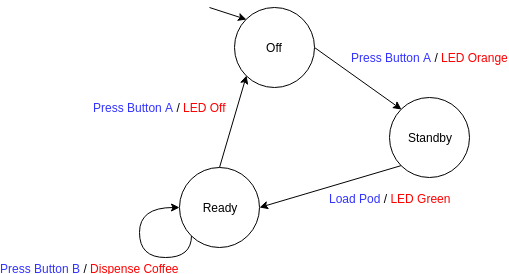

## Welcome to the Model Learning (Automata Learning) Blog by Johnathan DiMatteo

Imagine yourself as a child examining a coffee machine for the first time.
Your curiousity is grand, you would like to know what it is and how it works.
No need for a manual, you push some buttons and wait as the machine responds.
Quickly you realise the big button on top turns the machine on and the button to the right pours coffee - but wait!
The button on the right does not pour coffee when the machine is off.
It exhibits some *state dependent* behaviour.
Over time, you start to construct a model of the device in your brain: which buttons trigger which responses and under what conditions.
This is what Model Learning achieves; more specifically, about the design of algorithms that perform this task automatically.

> Definition of Model Learning: Given a black box system, construct an automata representation by providing inputs and observing outputs.

The first and oldest model learning algorithm we will look at is L*, developed by Dana Angluin in *Learning Regular Sets from Queries and Counter-Examples* (1987).
Nearly all model learning algorithms today use a similar approach.
Through *membership* and *equivalence* queries, the algorithm is able to construct a state diagram of the system.
An omniscient *Oracle* is necessary for this type of learning, but it can be approximated in practice (at the cost of complexity!). 

1. Membership Query: The algorithm sends an input sequence and recieves an output from the system.
2. Equivalence Query: The algorithm asks an Oracle if the automata learned so far is correct. If not, it sends back a counter-example.

Looking back at our coffee machine example, a membership query could be the following: press a bunch of buttons, and the coffee machine does something. 
Similarity, an equivalence query could be the following: explain to your older brother how you think the machine works. He responds with a counter example if you are wrong, and pats you on the back if you are correct.

### References
1. *Model Learning* by Frits Vaandrager. Communications of the ACM, Vol. 60 No. 2, Pages 86-95.
2. *Learning Regular Sets from Queries and Counter-Examples* by Dana Angluin. Information and Control. 75 (2): 87–106.
