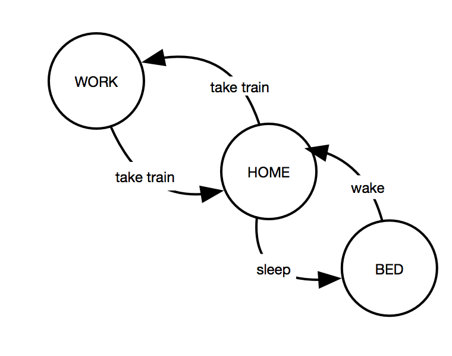

## Welcome to the Model Learning (Automata Learning) Blog by Johnathan DiMatteo

Imagine yourself as a child examining a coffee machine for the first time.
Your curiousity is grand, you would like to know what it is and how it works.
No need for a manual, you push some buttons and wait as the machine responds.
Quickly you realise the big button on top turns the machine on and the button to the right pours coffee - but wait!
The button on the right does not pour coffee when the machine is off.
It exhibits some *state dependent* behaviour.
Over time, you start to construct a model of the device in your brain: which buttons trigger which responses and under what conditions.
This is what Model Learning achieves; more specifically, about the design of algorithms that perform this task automatically.

State diagram of someone's life.

> Definition of Model Learning: Given a black box system, construct an automata representation by providing inputs and observing outputs.

The first and oldest model learning algorithm we will look at is L*, developed by Dana Angluin in *Learning Regular Sets from Queries and Counter-Examples* (1987).
Nearly all model learning algorithms today use a similar approach.
Through *membership* and *equivalence* queries, the algorithm is able to construct a state diagram of the system.
An omniscient *Oracle* is necessary for this type of learning, but it can be approximated in practice (at the cost of complexity!). 

1. **Membership Query**: The algorithm sends an input sequence and receives an output from the system.
2. **Equivalence Query**: The algorithm asks an Oracle if the automata learned so far is correct. If not, it sends back a counter-example.

Looking back at our coffee machine example, a membership query could be the following: press a bunch of buttons, and the coffee machine does something. 
Similarity, an equivalence query could be the following: explain to your older brother how you think the machine works. He responds with a counter example if you are wrong, and pats you on the back if you are correct (we are done!).

So the next logical question you may be wondering - how exactly does L* turn a bunch of membership queries into a state diagram?
It works by incrementally constructing an *Observation Table* through membership queries.
An element in the table is the Oracle's response to an input sequence.
Once a table is *closed* and *consistent*, the algorithm asks an equivalence query (for more details on these properties, see the original paper by Dana Angluin).

An observation table.

And finally, returning to our notion of an omniscient Oracle: how necessary is this requirement in practice?
In terms of membership queries, a system just has to be able to respond.
The Oracle can just pass the response to the algorithm.
But equivalence queries are problematic.
Thankfully, we approximate an Oracle by using brute force: given a hypothesized automata model from the algorithm, test it's correctness by sending thousands of inputs and making sure the response from the system is what we expect according to our model.
If there is a discrepancy, return the counter-example back to the algorithm.

### L * Code
  

### References
1. *Model Learning* by Frits Vaandrager. Communications of the ACM, Vol. 60 No. 2, Pages 86-95.
2. *Learning Regular Sets from Queries and Counter-Examples* by Dana Angluin. Information and Control. 75 (2): 87–106.
